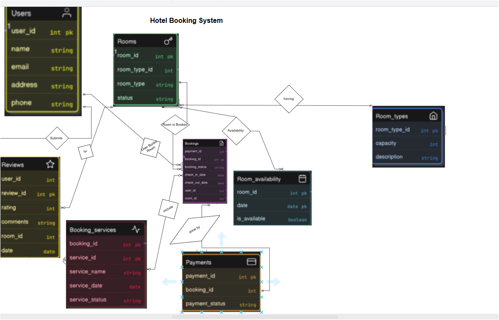

# Hotel Booking System

Database Systems final project (Milestone 05) — UET Peshawar, Spring 2025.

A full hotel reservation system: a normalized (3NF) MySQL schema plus a
Laravel implementation covering guest booking, payments, reviews, and an
admin panel.

## Entities
`Users`, `Rooms`, `Room_types`, `Bookings`, `Payments`, `Booking_services`,
`Reviews`, `Room_availability` — see `database/schema.sql` for the full 3NF
table definitions and foreign keys.

## Database (`database/`)
- `schema.sql` — table creation + the later enhancement columns
  (`booking_status`, `total_amount`, payment method/transaction fields).
- `triggers.sql` — business rules: auto-updating room availability on
  booking insert, and a trigger that blocks a review unless the user
  actually completed a stay in that room.
- `sample_queries.sql` — available rooms by date range, booking+user join,
  average room ratings.

## Application (`app/`, `resources/`, `routes/`)
Laravel MVC implementation:
- **Models**: `User`, `Room`, `Booking` (relationships + total-price
  calculation).
- **Controllers**: `BookingController` (create + double-booking check),
  `PaymentController` (payment processing + receipt), `AdminController`
  (dashboard, room management), `UserController` (profile + booking
  history), `RoomAvailabilityController` (calendar JSON endpoint),
  `ReportController` (occupancy & financial reports).
- **Views**: room availability search, booking form with live price
  calculation, payment receipt.
- **Routes**: `routes/web.php` — public, user and admin (`/admin/*`) route
  groups.

## Business rules enforced
- Room availability trigger on new bookings.
- Double-booking prevention (checked in `BookingController::store`).
- Reviews only allowed after a completed stay (DB trigger).

## Team
Faizan, Anees ur Rehman, Zeeshan Ahmad — Section B.
